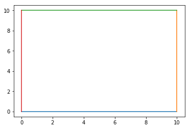
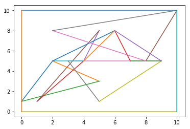
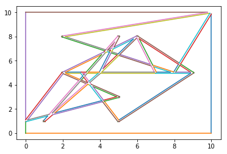
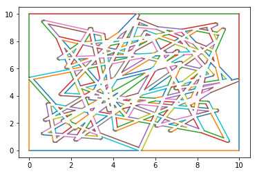

```python
from shapely.geometry.polygon import Polygon
from shapely.geometry.linestring import LineString
from shapely.geometry.multilinestring import MultiLineString
import matplotlib.pyplot as plt 
%matplotlib inline
```


```python
tangle = Polygon([(0,0),(10,0),(10,10),(0,10)])
```


```python
def plot_polygon(x):
    c = x.exterior.coords
    for i in range(len(c)-1):
        plt.plot([c[i][0],c[i+1][0]],[c[i][1],c[i+1][1]])
plot_polygon(tangle)
```





```python
a = Polygon([(0,1),(2,5),(5,3),(0,1)])
b = Polygon([(1,1),(4,5),(5,8),(1,1)])
c = Polygon([(9,5),(3,5),(5,1),(9,5)])
d = Polygon([(4,5),(2,5),(6,8),(4,5)])
e = Polygon([(9,5),(7,5),(6,8),(9,5)])
f = Polygon([(10,10),(8,5),(2,8),(10,10)])
for n in [a,b,c,d,e,f]:
    plot_polygon(n)
plot_polygon(tangle)
```





```python
a = LineString(a.exterior.coords)
b = LineString(b.exterior.coords)
c = LineString(c.exterior.coords)
d = LineString(d.exterior.coords)
e = LineString(e.exterior.coords)
f = LineString(f.exterior.coords)
```


```python
g = MultiLineString([a,b,c,d,e,f])
```


```python
g = g.buffer(0.05)
type(g)
```


    shapely.geometry.polygon.Polygon


```python
k = tangle.difference(g)
type(k)
```


    shapely.geometry.multipolygon.MultiPolygon


```python
i = 0
for p in list(k):
    plot_polygon(p)
    print(i)
    i += 1
```

    0
    1
    2
    3
    4
    5
    6
    7
    8
    9
    10
    11
    12
    13
    14
    15
    16
    17
    18
    19
    20
    21
    22
    





```python
import numpy as np 
px = 10 *np.random.random(30)
py = 10 * np.random.random(30)
p_list1 = [(px[i],py[i]) for i in range(30)]
p_list2 = [(py[i],px[i]) for i in range(30)]
lines = LineString(p_list1 + p_list2)

lines = lines.buffer(0.1)
```


```python
m = tangle.difference(lines)
i = 0
for p in list(m):
    plot_polygon(p)
    print(i)
    i += 1
```

    0
    1
    2
    3
    4
    5
    6
    7
    8
    9
    10
    11
    12
    13
    14
    15
    16
    17
    18
    19
    20
    21
    22
    23
    24
    25
    26
    27
    28
    29
    30
    31
    32
    33
    34
    35
    36
    37
    38
    39
    40
    41
    42
    43
    44
    45
    46
    47
    48
    49
    50
    51
    52
    53
    54
    55
    56
    57
    58
    59
    60
    61
    62
    63
    64
    65
    66
    67
    68
    69
    70
    71
    72
    73
    74
    75
    76
    77
    78
    79
    80
    81
    82
    83
    84
    85
    86
    87
    88
    89
    90
    91
    92
    93
    94
    95
    96
    97
    98
    99
    100
    101
    102
    103
    104
    105
    106
    107
    108
    109
    110
    111
    112
    113
    114
    115
    116
    117
    118
    119
    120
    121
    122
    123
    124
    125
    126
    127
    128
    129
    130
    131
    132
    133
    134
    135
    136
    137
    138
    139
    140
    141
    142
    143
    144
    145
    146
    147
    148
    149
    150
    151
    152
    153
    154
    155
    156
    157
    158
    159
    160
    161
    162
    163
    




